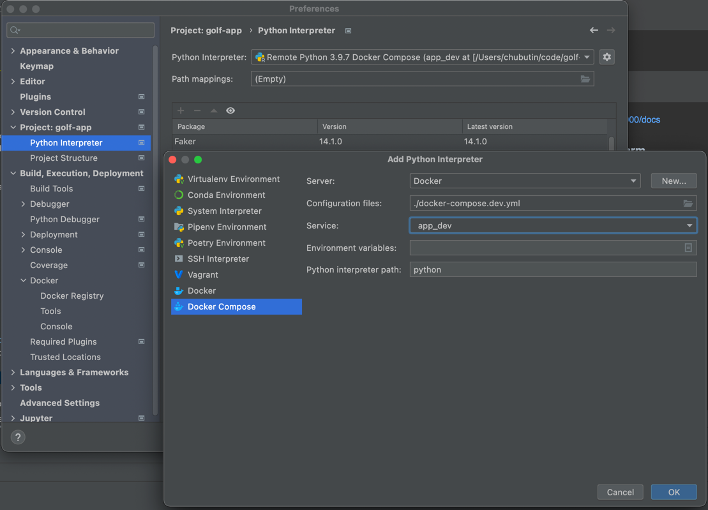
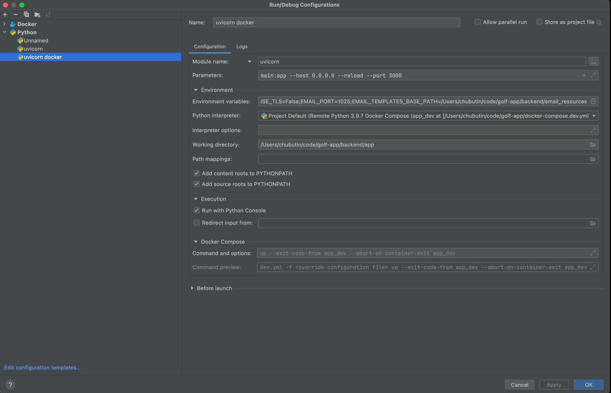

# Golf App


### How to configure all project

```shell
bin/setup
```

### How to run tests

```shell
bin/tests
```

### How to start the app

```shell
bin/up
```

JSON Api is published on http://localhost:3000/docs

### How to Remote Debug in Pycharm

Create a new Python Interpreter based on Docker Compose Dev



Create a new Python Run Config using the already created python docker interpreter




Run this Service as Debug!

### Test endpoints
Directory postman has a collection for all endpoins

### Useful URLs

[Local SMTP](http://localhost:8025)

[Backend JSON documentation](http://localhost:3000/docs)
